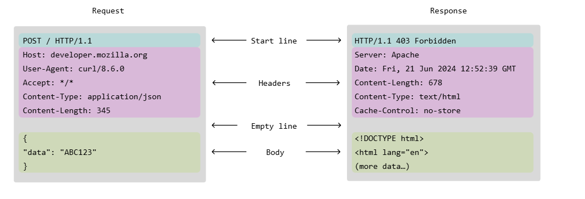
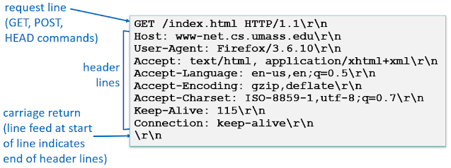

# Native Java HTTP Server

> Un servidor web multihilo de alto rendimiento implementado desde cero utilizando **Java Sockets** y **Virtual Threads (Project Loom)**, sin dependencias externas.

## Sobre el Proyecto

Este proyecto es una implementación del protocolo HTTP/1.1. El objetivo principal aprendizaje de los servidores web, eliminando la abstracción de frameworks como Spring Boot o Tomcat para interactuar directamente con la capa de transporte TCP.

El núcleo del servidor ha sido optimizado para soportar **alta concurrencia** mediante el uso de los nuevos **Virtual Threads** de Java 21, permitiendo manejar miles de conexiones simultáneas con un footprint de memoria mínimo.

## Implementación del Protocolo

El servidor cuenta con un motor propio de parseo y construcción de mensajes, diseñado estrictamente bajo los estándares del protocolo HTTP.

### Mensaje del servidor

El sistema maneja las dos estructuras fundamentales de comunicación (Request y Response), asegurando la correcta formación de la línea de estado, cabeceras y cuerpo.

### Estrategia de Parseo (CRLF)

Para interpretar el flujo de datos crudos provenientes del Socket, el parser identifica los delimitadores de control estándar. Se utiliza la secuencia de escape \r\n (CRLF: Carriage Return + Line Feed) para segmentar dinámicamente la metadata (Headers) del contenido (Body), tal como se ilustra el framento del mensaje a continuación:

